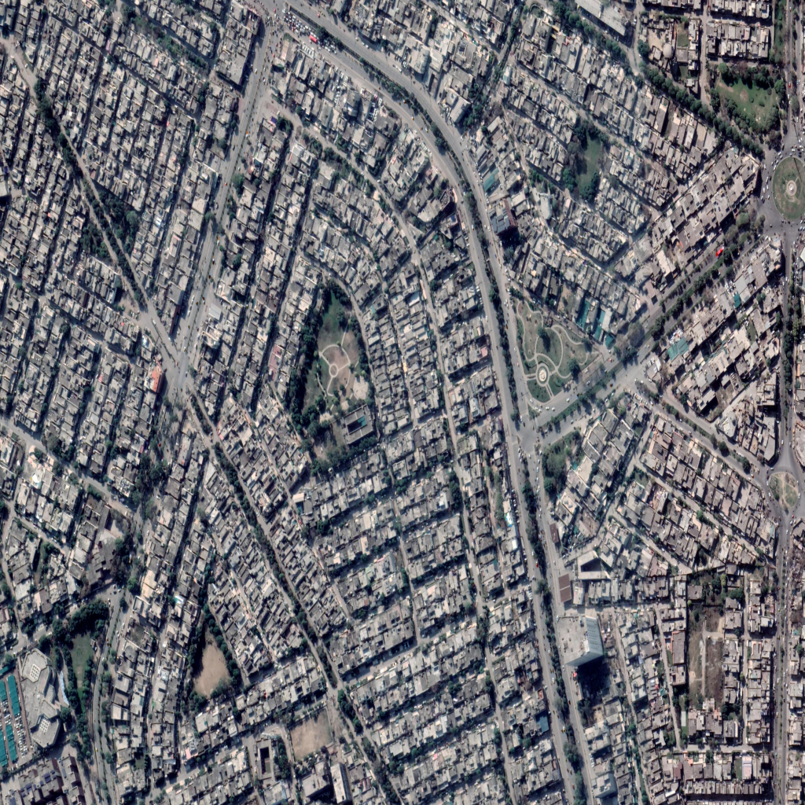
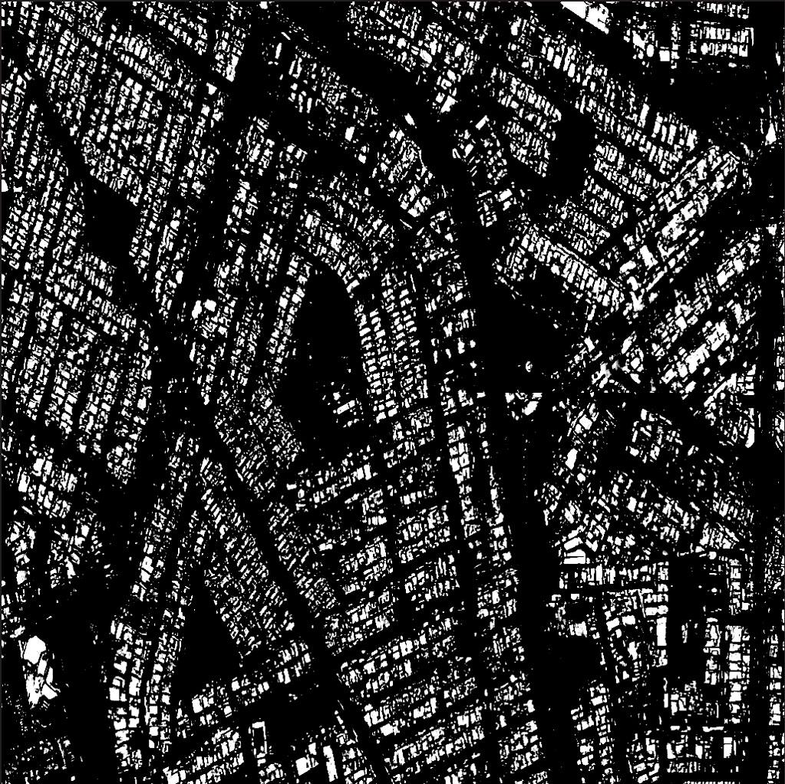
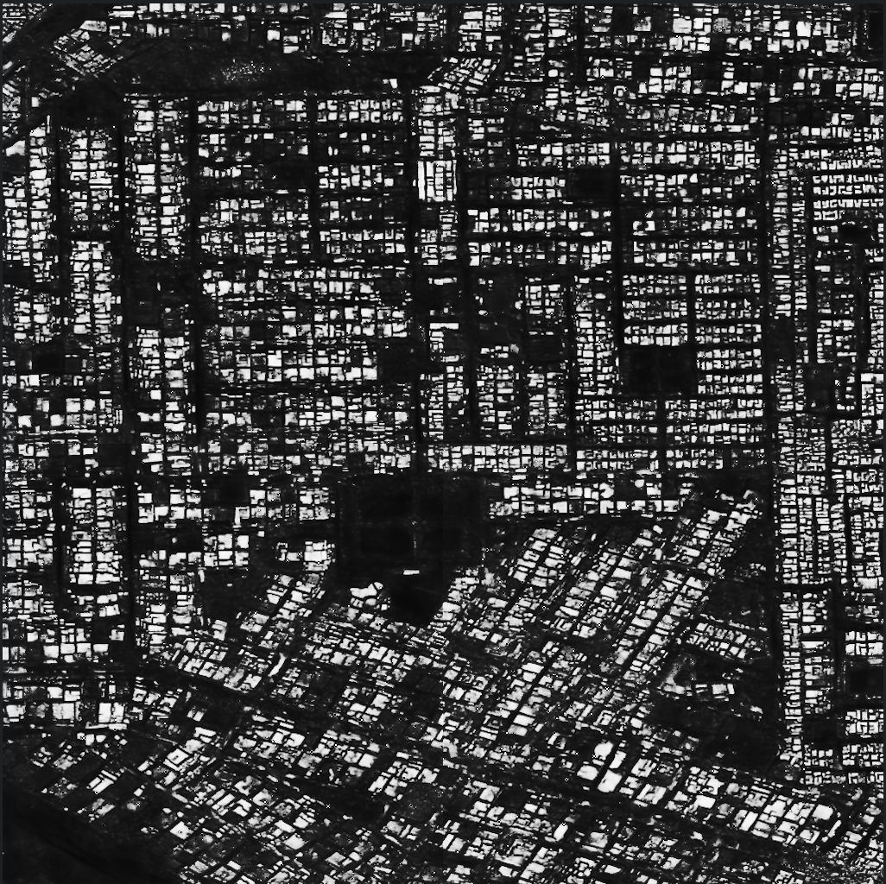
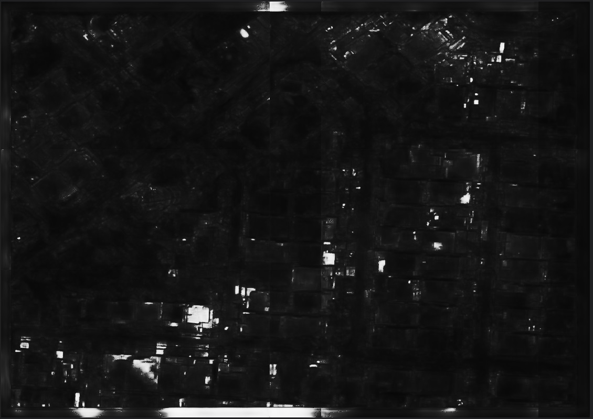
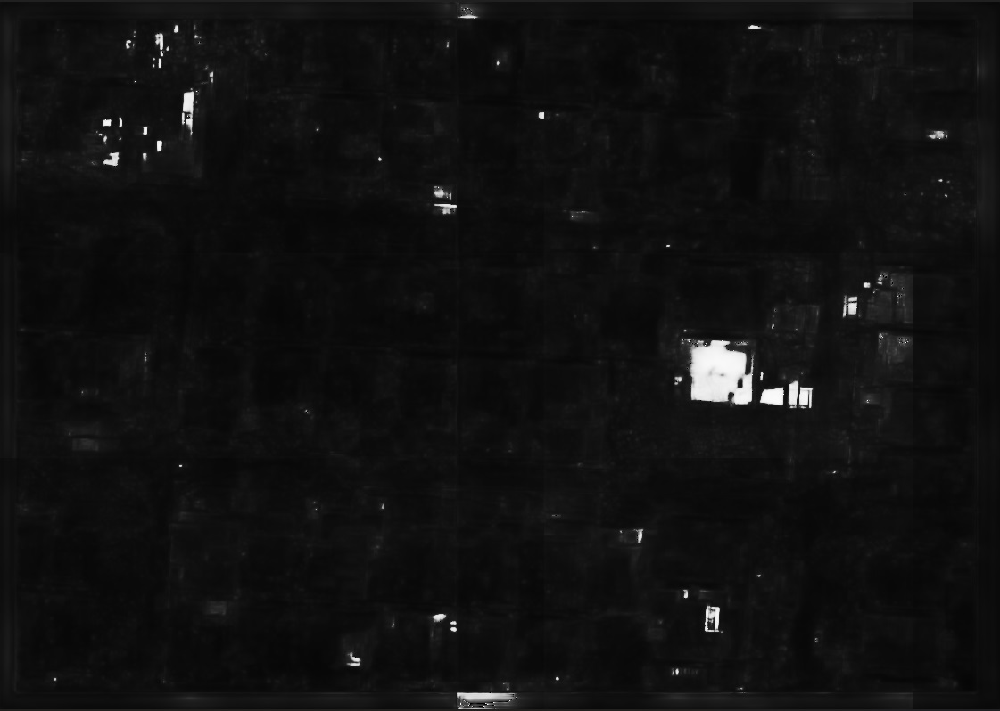

# House-Boundary-Detection
## Deep Learning project to detect house boundaries in Paksitan, using Solaris and Spacenet7 models

### For images captured at higher altitudes, displaying clustering akin to the Spacenet7 dataset, the image reconstruction is remarkably accurate, as evidenced by the samples below.

  

#### output

  

#### Sample 2

  

#### output

  

### However, when dealing with images captured at lower altitudes featuring lower resolution and expansive boundaries, the model struggles to generate accurate boundary masks. Given that a significant portion of data in Pakistan aligns with these characteristics, the model's accuracy is compromised.

  

#### output

  

#### Sample 2

  

#### output

  

