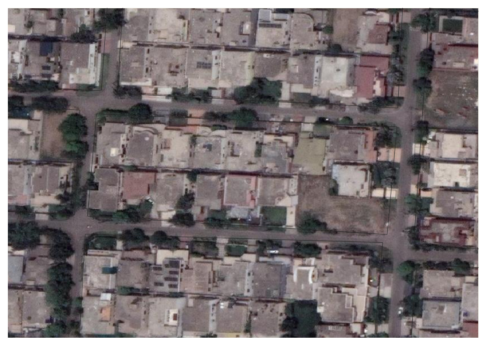

# House-Boundary-Detection
Deep Learning project to detect house boundaries in Paksitan, using Solaris and Spacenet7 models

### For Images that are taken from higher altitutde and resemble clustering simmilar to the Spacenet7 dataset, image reconstruction is highly accurate, as is evident from samples below

### output

### Sample 2

### output

### However for images that are taken from lower altitutdes and have lower resolution with large boundaries, the model fails to recognize house boundaries. Most data in Pakistan is simmilar to these examples, where results are not accurate.

### output

### Sample 2

### output

